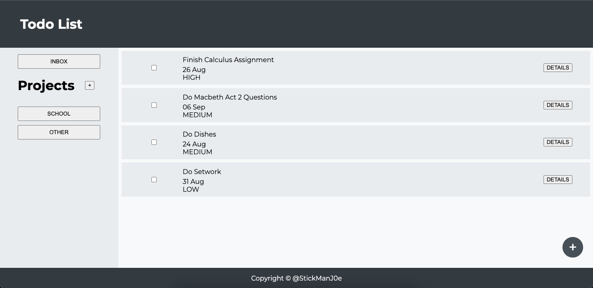
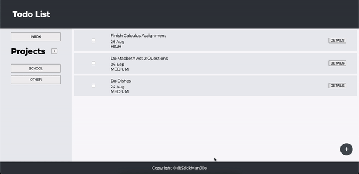
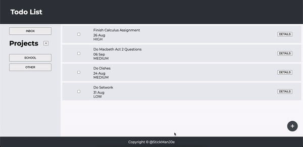

# Todo List
A simple todo list with all the classic features of creating tasks and sorting them into specific projects. Project is built with Webpack, HTML and Javascript, as well as utilising the local storage property to save tasks locally on user's device.

## Features
- Create tasks with a task name, description, due date, priority selectors and assigning to a specific project.

- Create multiple projects that you can add differnt tasks to.

- Saving tasks and projects locally using local storage.

## Built With
- Webpack
- Javascript
- HTML
- CSS